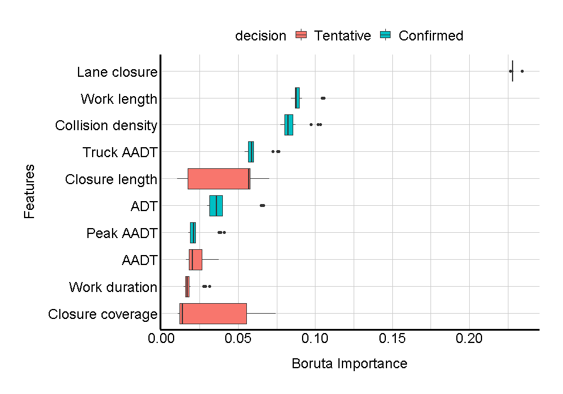
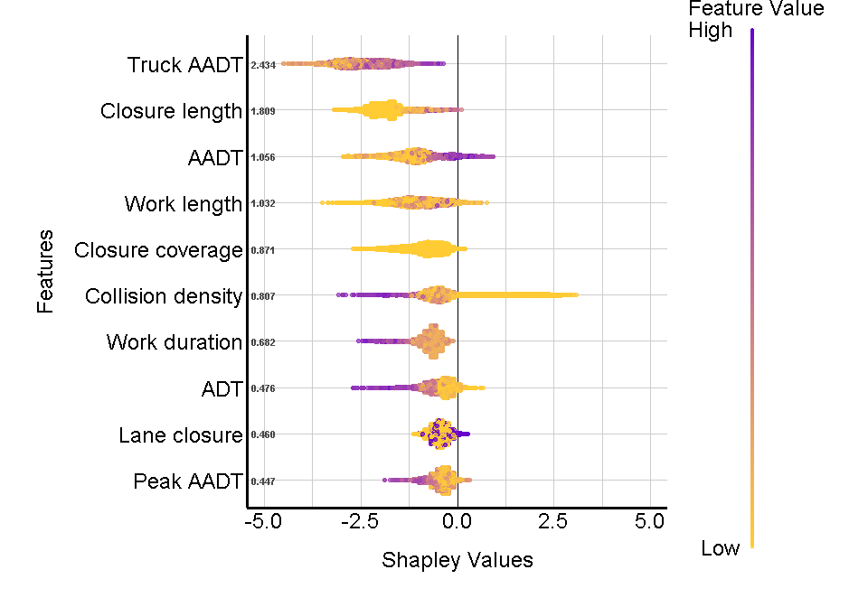

Boruta feature selection using xgBoost with SHAP analysis
================

Assuming a tunned xgBoost algorithm is already fitted to a training data
set (e.g., [look at my own
implementation](https://amirali-n.github.io/ExtremeGradientBoosting/)),
the next step is to identify feature importances. Although, feature
importances can be evalutated directly from the boosted trees, these
importances have been shown to be local and inconsistent; see [Scott
Lundberg et. al. (2019)](https://arxiv.org/abs/1905.04610).

Scott Lundberg’s paper proposed a new method to interpret the result of
machine learning algorithms, particularyly boosting methods, that
produce feature importance scores. They show that feature importance,
although averaged over boosted trees, may be inconsistent for different
observations. To overcome this inconsistency, they propose a SHAP score
inspired by [Shapley
values](http://www.library.fa.ru/files/Roth2.pdf#page=39) which combines
different explanation models, e.g., LIME, with Shapley values. The
result is a global feature importance score that is consistent across
different test sets.

However, other than to arbitrarily select an importance threshold beyond
which features are considered unimportant, SHAP analysis does not offer
an algorithmic way to filter a large feature set to a limited set of
important features.

To that end, a selection wrapper algorithm known as
[Boruta](https://pdfs.semanticscholar.org/85a8/b1d9c52f9f795fda7e12376e751526953f38.pdf%3E)
is proposed that iterates over an extended set of features and judges
their importance. In each iteration of the algorithm, a number of
features are copied by shuffling their values. This is used to fit
another learner and to re-evaluate feature importances. If importance of
an original feature is significantly greater than its shuffled copy,
that features is deemed important.

``` r
library(Boruta)
xgb.boruta=Boruta(train.df,
                  y=as.numeric(as.factor(label))-1,
                  maxRuns=100, 
                  doTrace=2,
                  holdHistory=TRUE,
                  getImp=getImpXgboost,
                  max.depth=xgb.train$bestTune$max_depth, 
                  eta=xgb.train$bestTune$eta, 
                  nthread=4, 
                  min_child_weight=xgb.train$bestTune$min_child_weight,
                  scale_pos_weight=sumwneg/sumwpos, 
                  eval_metric="auc", 
                  eval_metric="rmse", 
                  eval_metric="logloss",
                  gamma=xgb.train$bestTune$gamma,
                  nrounds=xgb.crv$best_iteration, 
                  objective="binary:logistic",
                  tree_method="hist",
                  lambda=0,
                  alpha=0)
```

Here, the <code>xgb.train</code> stores the result of a cross-validated
grid search to tune xgBoost hyperparameter; see
**classification\_xgBoost.R**. <code>xgb.cv</code> stores the result of
500 iterations of xgBoost with optimized paramters to determine the best
number of iterations.

After comparing feature importances, Boruta makes a decision about the
importance of a variable. If the importance of the shuffled copy is
greater than or equal to the importance of the original feature, the
decision is to <code>reject</code> that feature. If the original
feature’s importance is significantly greater than its shuffled copy,
then the decision is to <code>confirm</code> that feature. Otherwise,
Boruta is <code>tentative</code> about the true feature importance and
cannot make a confirmation or rejection decision. Below, the result of
100 iterations of the Boruta algorithm is extracted. We see that only 6
features are confirmed and Boruta is not sure about the other 4
features.

``` r
#extract Boruta's decision
boruta_dec=attStats(xgb.boruta)
boruta_dec[boruta_dec$decision!="Rejected",]
```

    ##                           meanImp  medianImp     minImp     maxImp  normHits
    ## work_duration          0.01843120 0.01672649 0.01458883 0.03129833 0.2105263
    ## work_length            0.09024640 0.08787454 0.08418951 0.10554205 1.0000000
    ## road_adt               0.03970042 0.03608476 0.02984146 0.06621855 1.0000000
    ## peak_aadt              0.02310977 0.02102032 0.01772834 0.04103140 1.0000000
    ## aadt                   0.02297146 0.02028527 0.01607130 0.03751448 0.8947368
    ## truck_aadt             0.06062656 0.05892022 0.05416555 0.07611600 1.0000000
    ## collision_density11_12 0.08477024 0.08232665 0.07743407 0.10314386 1.0000000
    ## closure_id1            0.22827060 0.22801835 0.22666455 0.23436917 1.0000000
    ## closure_coverage       0.03013895 0.01363442 0.01079567 0.07421263 0.3684211
    ## closure_length         0.04230922 0.05669478 0.01057845 0.07014895 0.6315789
    ##                         decision
    ## work_duration          Tentative
    ## work_length            Confirmed
    ## road_adt               Confirmed
    ## peak_aadt              Confirmed
    ## aadt                   Tentative
    ## truck_aadt             Confirmed
    ## collision_density11_12 Confirmed
    ## closure_id1            Confirmed
    ## closure_coverage       Tentative
    ## closure_length         Tentative

For visualization purposes, here, the history of Boruta importance
evaluation is extracted to generate a box and whiskers plot.

``` r
#get the names of each feature
imp_features=row.names(boruta_dec)[which(boruta_dec$decision!="Rejected")]
#get feature importance history
boruta.imp.df=as.data.frame(xgb.brouta$ImpHistory)
#keep only confirmed and tentative features
boruta.imp.df=boruta.imp.df[,names(boruta.imp.df)%in%imp_features]
#transform the data to a data frame with two columns: feature and importance value
boruta.imp.df=melt(boruta.imp.df)
#create a data frame by adding the decision for each feature as well
boruta.imp.df=cbind.data.frame(boruta.imp.df, 
                               decision=boruta.df$decision[match(boruta.imp.df$variable, 
                                                                 row.names(boruta.df))])
#reorder features data frame by the importance median value
feature_order=with(boruta.imp.df, reorder(variable, value, median, order = TRUE))
boruta.imp.df$variable=factor(boruta.imp.df$variable, levels = levels(feature_order))
```



The feature importances are plotted using ggplot
<code>geom\_boxplot</code>. They show that lane closure, work length,
and collision density are the top three important features. Boruta is
very effective in reducing the number of features from more than 700 to
just 10. However, these importances may not be consistent with respect
to the test set. SHAP values take each data point into consideration
when evaluating the importance of a feature. The below code snippet,
takes the outcome of an xgBoost fitted model in <code>xgb.mod</code> and
evaluates its SHAP values.

``` r
shap_values=shap.values(xgb_model = xgb.mod, X_train = dtest)
shap_values$mean_shap_score[1:10]
```

    ##             truck_aadt         closure_length               route219 
    ##              2.4266525              1.8072355              1.3646507 
    ##                   aadt         activityD41000           countySB-SLO 
    ##              1.0542142              1.0524380              1.0315518 
    ##            work_length              countyINY       closure_coverage 
    ##              1.0265423              0.9364988              0.8734378 
    ## collision_density11_12 
    ##              0.8160600

It can be seen the the top 10 most important features of the SHAP tree
explainer do not agree with the Boruta algorithm. Although, some
features are important according to both methods, SHAP values consider
new features such as <code>route 219</code>, <code>activity
D41000</code>, or <code>county SB to SLO</code> as important in
predicting the class of the test set data point. Furthermore, the order
of importance for those features which re deemed as importance by both
methods is not consistent. The code snippet below limits the shap score
and test set to the features selected by the Boruta method and plots
SHAP values for each data point in test set diluted by a factor of 20.

``` r
shap.feat=unique(boruta.imp.df$variable)
X=data.frame(as.matrix(dtest))
X=X[, names(X) %in% shap.feat]

#removing outliers for better visualization
inliers=which(X$work_duration<=0.2 & X$work_duration>=0 &
              X$work_length<=0.4 & X$work_length>=0 &
              X$road_adt<=0.8 & X$road_adt>=0 &
              X$peak_aadt<=0.3 & X$peak_aadt>=0 &
              X$aadt<=0.8 & X$aadt>=0 &
              X$truck_aadt<=0.4 & X$truck_aadt>=0 &
              X$collision_density11_12<=0.6 & X$collision_density11_12>=0 &
              X$closure_coverage<=1 & X$closure_coverage>=0 &
              X$closure_length<=0.2 & X$closure_length>=0)

#shap summary for boruta features
shap_score_filtered=data.frame(shap_values$shap_score)
shap_score_filtered=shap_score_filtered[inliers, names(shap_score_filtered) %in% shap.feat]

#plot
shap.plot.summary.wrap2(shap_score = shap_score_filtered, 
                        X = X[inliers,],
                        dilute=20)
```



The SHAP summary plots shows that considering only the features selected
by Boruta does not resolve the difference between SHAP values and Boruta
importances. The resulting order of feautre importances is completely
different in SHAP tree explainer method. However, assuming features
selected by Boruta are actually the most important features, the SHAP
summary plot allows us to see how each feature contributes to the
classification process. For example, consider the case of <code>Lane
closure</code> feature. The shop summary plot shows that higher values
of Lane closure (i.e., Lane closure = 1) increase the probability of the
positive class (which in this case denotes the probability of collision
with roadside work zones). This analysis could be usefull if we had more
confidence in the selected features and their importances.

To reconcile Boruta and SHAP analysis, a combination of these methods
may be the solution. An algorithm that copies the features and shuffles
their values, but evaluates the importance of the original and its copy
using Shapley values, and tests whether original importance of a feature
is significantly greater that its shuffled copy. This can be done by a
library in python known as
[BorutaShap](https://pypi.org/project/BorutaShap/). Here is my
implementation of the algorithm in python.
